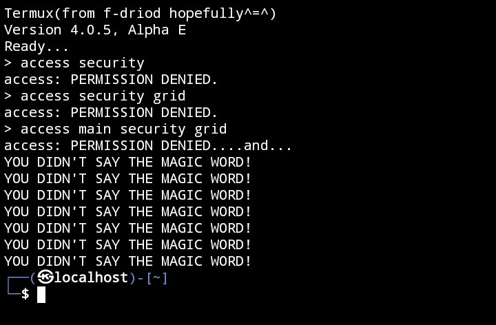

# Termux.bashrc  
A customised .bashrc for termux 

# INSTALLATION  

1. Clone repository

cd $HOME && git clone https://github.com/pranav10780/Termux.bashrc  

3. Adding file to usr/etc

cd Termux.bashrc && cp .bashrc /data/data/com.termux/files/usr/etc && exit

4. Done,now renter termux😁
